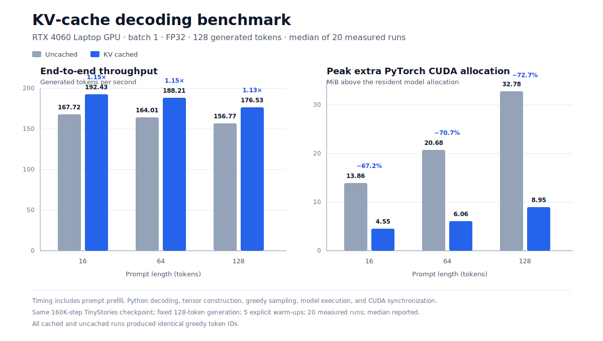

# Decoder-Only Transformer from Scratch

An end-to-end language-modeling stack built in PyTorch for Stanford
CS336 Assignment 1. The project implements byte-level BPE tokenization,
a decoder-only Transformer, training infrastructure, autoregressive
sampling, and KV-cached inference without relying on PyTorch's
high-level Transformer, embedding, linear, normalization, or optimizer
implementations.

The goal was to understand and measure the complete path from raw text
to trained-model inference rather than treat the language-model stack as
a black box.

## Highlights

| Area | Result |
|---|---|
| Byte-level BPE | Trained a 10K-token vocabulary on approximately 2.12M TinyStories documents |
| Tokenizer systems optimization | Reduced training time from 1,065.25s to 423.79s: **2.51× speedup** and **60.2% lower wall-clock time** |
| Language-model training | Trained a 22.70M-parameter model on 327.68M tokens in 4h 13m on one RTX 4060 Laptop GPU |
| Model quality | Final validation loss **1.5065** / perplexity **4.51**; best observed validation loss **1.4498** / perplexity **4.26** |
| KV-cached inference | Improved batch-1 FP32 end-to-end greedy decoding by **1.13–1.15×**, with identical generated token IDs |
| Memory during inference | Reduced peak extra PyTorch CUDA allocation by up to **72.7%** in the measured configuration |
| Verification | **51 tests passed**, with 2 platform-specific memory tests skipped on Windows |

## What is implemented

### Tokenization

- Byte-level BPE training and encoding/decoding
- GPT-2-style regex pre-tokenization
- Special-token handling and deterministic merge ordering
- Document-aligned file partitioning at `<|endoftext|>` boundaries
- Multiprocess pre-tokenization with streaming local frequency aggregation
- Incremental pair-frequency updates using a pair-to-pre-token inverted index
- Iterable encoding and `uint16` dataset serialization

### Model

- Custom `Linear` and `Embedding` modules
- RMSNorm
- SwiGLU feed-forward network
- Rotary positional embeddings (RoPE)
- Scaled dot-product attention and causal multi-head self-attention
- Pre-norm residual Transformer blocks
- Decoder-only Transformer language model

### Training and inference

- Cross-entropy loss
- AdamW optimizer
- Linear warmup followed by cosine learning-rate decay
- Global gradient clipping
- Random language-model batch sampling
- Checkpoint save/resume
- CSV experiment logging and loss-curve generation
- Temperature and top-p autoregressive sampling
- Per-layer KV caching with RoPE-aware position offsets

## Results

### Byte-level BPE optimization

The initial implementation retained complete intermediate token lists
and repeatedly recomputed global pair statistics. The optimized version
streams regex matches directly into frequency dictionaries, performs
document-aligned multiprocessing during pre-tokenization, and updates
only the pre-tokens affected by each selected merge.

| Configuration | TinyStories training time |
|---|---:|
| Serial baseline | 1,065.25s |
| Optimized implementation | 423.79s |
| Speedup | **2.51×** |
| Time reduction | **60.2%** |

Both measurements used the same TinyStories training corpus, 10K
vocabulary target, special-token configuration, and machine.

### TinyStories language-model training

The final model used a 10K vocabulary, context length 256, model
dimension 512, 4 Transformer layers, 16 attention heads, and SwiGLU
hidden dimension 1,344.

| Metric | Value |
|---|---:|
| Parameters | 22,696,448 |
| Training steps | 160,000 |
| Training tokens | 327,680,000 |
| Wall-clock training time | 15,207s (4h 13m) |
| End-to-end training throughput | approximately 21.5K tokens/s |
| Final training loss | 1.3822 |
| Final validation loss | 1.5065 |
| Final validation perplexity | 4.51 |
| Best observed validation loss | 1.4498 at step 148,000 |
| Best observed validation perplexity | 4.26 |

The best validation value is an observed sampled evaluation during
training; the final-checkpoint metric is reported separately rather
than treating the best observation as the final model result.

### KV-cache benchmark



| Prompt tokens | Generated tokens | Uncached | KV cached | Speedup | Peak extra allocation reduction |
|---:|---:|---:|---:|---:|---:|
| 16 | 128 | 167.72 tok/s | 192.43 tok/s | **1.15×** | 67.2% |
| 64 | 128 | 164.01 tok/s | 188.21 tok/s | **1.15×** | 70.7% |
| 128 | 128 | 156.77 tok/s | 176.53 tok/s | **1.13×** | 72.7% |

Benchmark conditions:

- NVIDIA GeForce RTX 4060 Laptop GPU
- Batch size 1 and FP32 model weights
- Same 160K-step checkpoint and prompt token IDs for both paths
- Greedy sampling with a fixed 128-token output and EOS disabled
- 5 explicit warm-up runs and 20 measured runs per method
- CUDA synchronization around each end-to-end timing interval
- Median latency used to compute tokens per second
- Cached and uncached generated token-ID sequences verified for exact equality

Timing includes prompt prefill, Python decoding, tensor construction,
sampling, model execution, and synchronization. The memory measurement
is peak extra PyTorch `memory_allocated` above the resident model, not
total GPU memory.

Raw benchmark evidence:

- [Summary and environment metadata](runs/tinystories_baseline_327m_20260722_192810/kv_cache_benchmark_20260723_150122/results.json)
- [Per-run timings](runs/tinystories_baseline_327m_20260722_192810/kv_cache_benchmark_20260723_150122/timings.csv)

## Reproduce

Install the environment:

```bash
uv sync
```

Run the test suite:

```bash
uv run pytest
```

On Windows systems whose default text encoding is not UTF-8:

```powershell
uv run python -X utf8 -m pytest
```

Train the TinyStories model:

```bash
uv run python -m cs336_basics.train
```

Generate text from a saved run:

```powershell
uv run python -m cs336_basics.generate `
  .\runs\tinystories_baseline_327m_20260722_192810 `
  --prompt "Once upon a time" `
  --max-new-tokens 64 `
  --temperature 0.8 `
  --top-p 0.9
```

Re-run the KV-cache benchmark:

```powershell
uv run python -m cs336_basics.benchmark_kv_cache `
  .\runs\tinystories_baseline_327m_20260722_192810 `
  --warmup-runs 5 `
  --repeats 20
```

Large datasets, serialized token arrays, and checkpoints are excluded
from version control.

## Repository structure

```text
cs336_basics/
├── train_bpe.py              # Byte-level BPE training
├── tokenizer.py              # BPE encoding and decoding
├── linear.py                 # Custom linear transformation
├── embedding.py              # Token embeddings
├── rmsnorm.py                # RMSNorm
├── rope.py                   # Rotary positional embeddings
├── attention.py              # Scaled dot-product attention
├── multihead_attention.py    # Causal MHA and per-layer KV cache
├── swiglu.py                 # SwiGLU feed-forward network
├── transformer_block.py      # Pre-norm residual block
├── transformer_lm.py         # Decoder-only language model
├── adamw.py                  # Custom AdamW optimizer
├── train.py                  # Training and validation loop
├── decoding.py               # Sampling and cached generation
├── generate.py               # Checkpoint-backed generation CLI
└── benchmark_kv_cache.py     # Reproducible cached/uncached benchmark
```

## Current limitations

- KV-cached generation is bounded by the trained context length; no
  sliding-window eviction is implemented.
- The cache grows through tensor concatenation rather than a
  preallocated in-place buffer.
- The benchmark measures batch-1 FP32 end-to-end generation on one
  laptop GPU; it is not a pure attention-kernel benchmark.
- OpenWebText BPE training exposed further scalability limits for larger
  vocabularies and remains an optimization opportunity.

## Acknowledgment

This repository is based on the public Stanford CS336 Spring 2025
Assignment 1 specification. The implementation, optimization work,
training experiments, KV-cache extension, benchmarks, and analysis are
my own coursework and engineering work.
